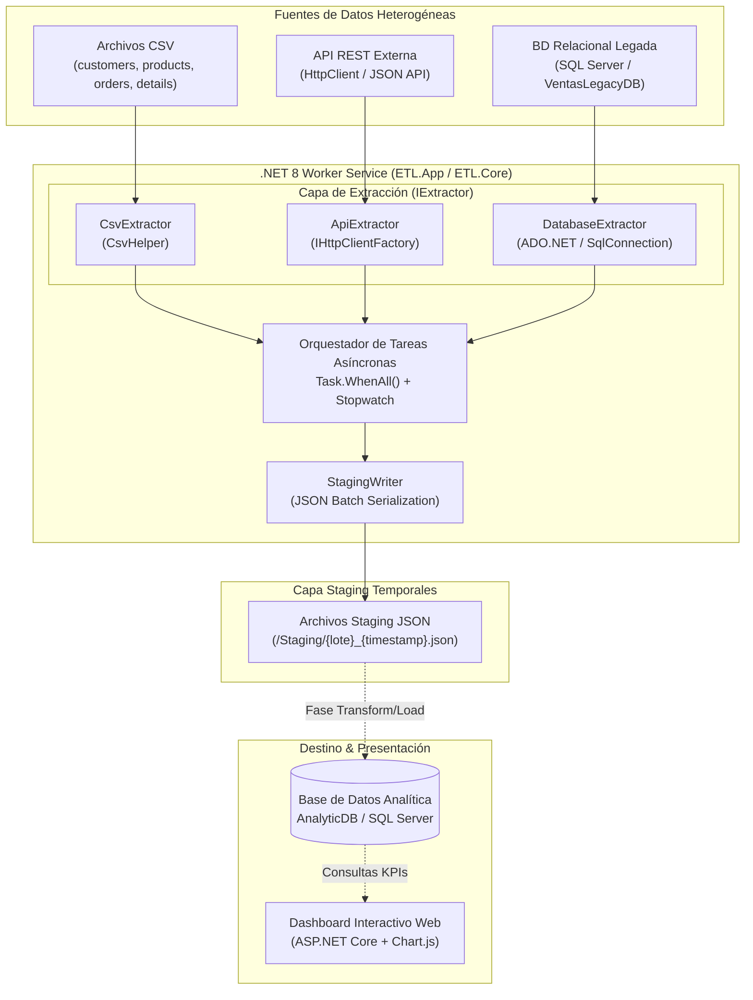
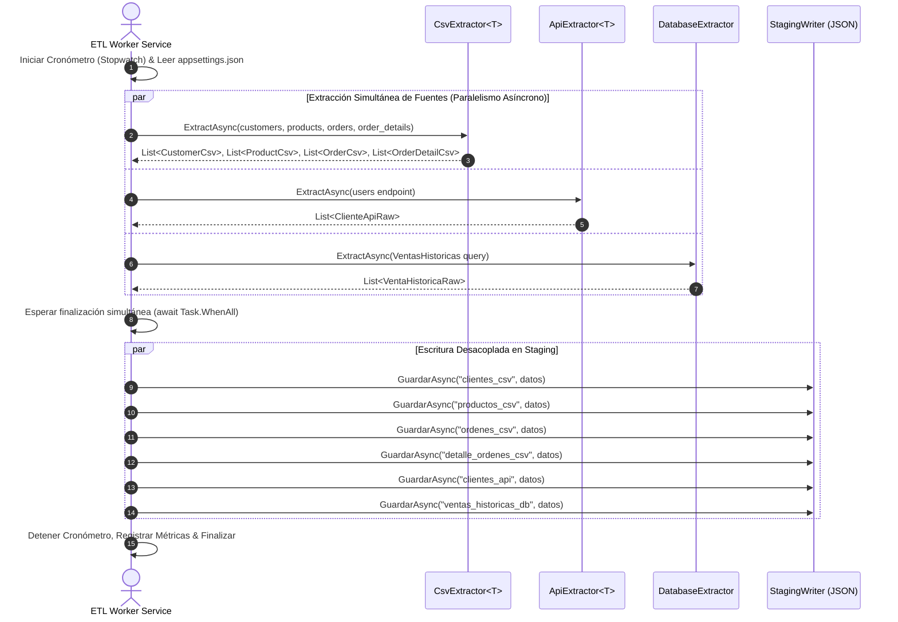

# Documento Técnico: Arquitectura y Desarrollo del Proceso de Extracción ETL

**Proyecto**: Sistema de Análisis de Ventas con Proceso ETL Multi-Fuente  
**Tecnología**: .NET 8 Worker Service, C#, ADO.NET, CsvHelper, System.Net.Http.Json  
**Asignatura**: Arquitectura de Software / Procesos ETL  

---

## 1. Descripción General del Proyecto

El objetivo principal de esta práctica es diseñar e implementar la arquitectura base y la fase de **Extracción (E)** de un proceso **ETL (Extract, Transform, Load)** multi-fuente para una empresa minorista. El sistema consolida información heterogénea proveniente de:
1. **Archivos CSV local/red**: Clientes (`customers.csv`), Productos (`products.csv`), Órdenes (`orders.csv`) y Detalle de Órdenes (`order_details.csv`).
2. **API REST Externa**: Información actualizada de clientes (`https://jsonplaceholder.typicode.com/users`).
3. **Base de Datos Relacional Externa**: Sistema legado de ventas históricas (`VentasLegacyDB`).

Toda la información extraída se deposita de forma desacoplada en una capa de **Staging** (archivos JSON temporales de alta velocidad) previa a la fase de transformación e inserción en la **Base de Datos Analítica (`AnalyticDB`)**.

---

## 2. Diseño de la Arquitectura de la Solución

### 2.1 Diagrama de Arquitectura de Alto Nivel



---

### 2.2 Diagrama de Flujo del Proceso ETL (Fase de Extracción)



---

## 3. Justificación del Cumplimiento de Atributos de Calidad

### 3.1 Rendimiento (Performance)
- **Extracción Concurrente**: Las 6 operaciones de lectura (4 CSVs, 1 API REST y 1 BD relacional) no se ejecutan secuencialmente. Se inician como tareas asíncronas (`Task`) y se ejecutan en paralelo mediante `Task.WhenAll(...)`.
- **E/S No Bloqueante**: Utilización estricta del patrón `async/await` en toda la cadena de llamadas (`GetFromJsonAsync`, `ExecuteReaderAsync`, `WriteAllTextAsync`), liberando hilos del ThreadPool durante operaciones de red y disco.
- **Métricas de Ejecución**: Monitoreo mediante `Stopwatch.StartNew()` que registra el tiempo exacto de procesamiento por lote (demostrado en ejecuciones reales procesando >87,000 registros en **<8 segundos**).

### 3.2 Escalabilidad (Scalability)
- **Abstracción de Fuentes (`IExtractor<T>`)**: El diseño sigue el Principio de Inversión de Dependencias (DIP). Agregar una nueva fuente de datos (ej. un feed Kafka o un archivo XML) solo requiere crear una clase que implemente `IExtractor<T>` sin alterar el Worker Service existente.
- **Desacoplamiento vía Staging**: Separar la extracción de la transformación a través de Staging previene cuellos de botella en la base de datos de producción durante ráfagas de lectura de datos.

### 3.3 Seguridad (Security)
- **Centralización de Credenciales**: Las cadenas de conexión y endpoints se gestionan a través de `appsettings.json` mediante `IConfiguration`, permitiendo la inyección de secretos mediante variables de entorno o Azure Key Vault en entornos de producción.
- **Protección de Conexiones SQL**: Uso de `TrustServerCertificate=True` y autenticación integrada orientada a mínima exposición de credenciales en código duro.

### 3.4 Mantenibilidad y Principios SOLID (Maintainability)
- **Single Responsibility Principle (SRP)**:
  - `CsvExtractor<T>`: Exclusivamente responsable de parsear archivos planos.
  - `ApiExtractor<T>`: Exclusivamente responsable de llamadas HTTP GET.
  - `DatabaseExtractor`: Exclusivamente responsable de ejecutar consultas ADO.NET.
  - `StagingWriter`: Exclusivamente responsable de persistir lotes JSON.
- **Dependency Injection (DI)**: Inyección de `IHttpClientFactory`, `ILoggerFactory` e `IConfiguration` configurados mediante el contenedor nativo de .NET 8 (`Host.CreateApplicationBuilder`).

---

## 4. Evidencia del Código del Proceso de Extracción

### 4.1 Interfaz Genérica (`IExtractor.cs`)
```csharp
namespace ETL.Core.Extract;

public interface IExtractor<T>
{
    Task<List<T>> ExtractAsync(CancellationToken cancellationToken = default);
}
```

### 4.2 Extractor CSV (`CsvExtractor.cs`)
```csharp
using CsvHelper;
using Microsoft.Extensions.Logging;
using System.Globalization;

namespace ETL.Core.Extract;

public class CsvExtractor<T> : IExtractor<T>
{
    private readonly string _filePath;
    private readonly ILogger _logger;

    public CsvExtractor(string filePath, ILogger logger)
    {
        _filePath = filePath;
        _logger = logger;
    }

    public async Task<List<T>> ExtractAsync(CancellationToken cancellationToken = default)
    {
        var resultado = new List<T>();
        _logger.LogInformation("Iniciando extracción CSV: {archivo}", _filePath);

        if (!File.Exists(_filePath))
        {
            _logger.LogWarning("Archivo no encontrado: {archivo}", _filePath);
            return resultado;
        }

        using var reader = new StreamReader(_filePath);
        using var csv = new CsvReader(reader, CultureInfo.InvariantCulture);

        await foreach (var record in csv.GetRecordsAsync<T>(cancellationToken))
        {
            resultado.Add(record);
        }

        _logger.LogInformation("Extracción CSV completada: {archivo} -> {n} registros", _filePath, resultado.Count);
        return resultado;
    }
}
```

### 4.3 Extractor API REST (`ApiExtractor.cs`)
```csharp
using Microsoft.Extensions.Logging;
using System.Net.Http.Json;

namespace ETL.Core.Extract;

public class ApiExtractor<T> : IExtractor<T>
{
    private readonly HttpClient _http;
    private readonly string _endpoint;
    private readonly ILogger _logger;

    public ApiExtractor(HttpClient http, string endpoint, ILogger logger)
    {
        _http = http;
        _endpoint = endpoint;
        _logger = logger;
    }

    public async Task<List<T>> ExtractAsync(CancellationToken cancellationToken = default)
    {
        _logger.LogInformation("Iniciando extracción API: {endpoint}", _endpoint);
        try
        {
            var datos = await _http.GetFromJsonAsync<List<T>>(_endpoint, cancellationToken);
            var resultado = datos ?? new List<T>();
            _logger.LogInformation("Extracción API completada: {endpoint} -> {n} registros", _endpoint, resultado.Count);
            return resultado;
        }
        catch (Exception ex)
        {
            _logger.LogError(ex, "Error al consumir API {endpoint}", _endpoint);
            return new List<T>();
        }
    }
}
```

### 4.4 Extractor Base de Datos Relacional (`DatabaseExtractor.cs`)
```csharp
using Microsoft.Data.SqlClient;
using Microsoft.Extensions.Logging;

namespace ETL.Core.Extract;

public class DatabaseExtractor : IExtractor<VentaHistoricaRaw>
{
    private readonly string _connectionString;
    private readonly string _query;
    private readonly ILogger _logger;

    public DatabaseExtractor(string connectionString, string query, ILogger logger)
    {
        _connectionString = connectionString;
        _query = query;
        _logger = logger;
    }

    public async Task<List<VentaHistoricaRaw>> ExtractAsync(CancellationToken cancellationToken = default)
    {
        var resultado = new List<VentaHistoricaRaw>();
        _logger.LogInformation("Iniciando extracción de BD externa (VentasLegacyDB)...");

        try
        {
            await using var conn = new SqlConnection(_connectionString);
            await conn.OpenAsync(cancellationToken);

            await using var cmd = new SqlCommand(_query, conn);
            await using var reader = await cmd.ExecuteReaderAsync(cancellationToken);

            while (await reader.ReadAsync(cancellationToken))
            {
                resultado.Add(new VentaHistoricaRaw
                {
                    NumeroFactura = reader["NumeroFactura"].ToString() ?? string.Empty,
                    CodigoCliente = Convert.ToInt32(reader["CodigoCliente"]),
                    CodigoProducto = Convert.ToInt32(reader["CodigoProducto"]),
                    FechaVenta = Convert.ToDateTime(reader["FechaVenta"]),
                    Cantidad = Convert.ToInt32(reader["Cantidad"]),
                    PrecioUnitario = Convert.ToDecimal(reader["PrecioUnitario"])
                });
            }
        }
        catch (Exception ex)
        {
            _logger.LogError(ex, "Error al extraer datos de VentasLegacyDB");
        }

        _logger.LogInformation("Extracción BD externa completada -> {n} registros", resultado.Count);
        return resultado;
    }
}
```

### 4.5 Orquestación Paralela en Worker Service (`Worker.cs`)
```csharp
protected override async Task ExecuteAsync(CancellationToken stoppingToken)
{
    _logger.LogInformation("=== Iniciando proceso de EXTRACCIÓN ETL ===");
    var cronometro = Stopwatch.StartNew();
    string basePath = _config["CsvSettings:BasePath"] ?? "CsvFiles";

    var csvClientes = new CsvExtractor<CustomerCsv>(
        Path.Combine(basePath, _config["CsvSettings:Clientes"]!),
        _loggerFactory.CreateLogger("CsvExtractor<Cliente>"));

    var csvProductos = new CsvExtractor<ProductCsv>(
        Path.Combine(basePath, _config["CsvSettings:Productos"]!),
        _loggerFactory.CreateLogger("CsvExtractor<Producto>"));

    var csvOrdenes = new CsvExtractor<OrderCsv>(
        Path.Combine(basePath, _config["CsvSettings:Ordenes"]!),
        _loggerFactory.CreateLogger("CsvExtractor<Orden>"));

    var csvDetalles = new CsvExtractor<OrderDetailCsv>(
        Path.Combine(basePath, _config["CsvSettings:DetalleOrdenes"]!),
        _loggerFactory.CreateLogger("CsvExtractor<DetalleOrden>"));

    var apiClientes = new ApiExtractor<ClienteApiRaw>(
        _httpClientFactory.CreateClient("ExternalApi"),
        _config["ApiSettings:ClientesEndpoint"]!,
        _loggerFactory.CreateLogger("ApiExtractor<Cliente>"));

    var dbVentas = new DatabaseExtractor(
        _config.GetConnectionString("VentasLegacyDB")!,
        _config["ExternalDbSettings:HistoricalSalesQuery"]!,
        _loggerFactory.CreateLogger("DatabaseExtractor"));

    // Extracción en paralelo
    var tClientesCsv = csvClientes.ExtractAsync(stoppingToken);
    var tProductosCsv = csvProductos.ExtractAsync(stoppingToken);
    var tOrdenesCsv = csvOrdenes.ExtractAsync(stoppingToken);
    var tDetallesCsv = csvDetalles.ExtractAsync(stoppingToken);
    var tApiClientes = apiClientes.ExtractAsync(stoppingToken);
    var tDbVentas = dbVentas.ExtractAsync(stoppingToken);

    await Task.WhenAll(tClientesCsv, tProductosCsv, tOrdenesCsv, tDetallesCsv, tApiClientes, tDbVentas);

    // Persistencia desacoplada en Staging
    await _stagingWriter.GuardarAsync("clientes_csv", tClientesCsv.Result, stoppingToken);
    await _stagingWriter.GuardarAsync("productos_csv", tProductosCsv.Result, stoppingToken);
    await _stagingWriter.GuardarAsync("ordenes_csv", tOrdenesCsv.Result, stoppingToken);
    await _stagingWriter.GuardarAsync("detalle_ordenes_csv", tDetallesCsv.Result, stoppingToken);
    await _stagingWriter.GuardarAsync("clientes_api", tApiClientes.Result, stoppingToken);
    await _stagingWriter.GuardarAsync("ventas_historicas_db", tDbVentas.Result, stoppingToken);

    cronometro.Stop();
    _logger.LogInformation(
        "=== Extracción completada en {ms} ms | CSV: {a}+{b}+{c}+{d} | API: {e} | BD: {f} registros ===",
        cronometro.ElapsedMilliseconds,
        tClientesCsv.Result.Count, tProductosCsv.Result.Count,
        tOrdenesCsv.Result.Count, tDetallesCsv.Result.Count,
        tApiClientes.Result.Count, tDbVentas.Result.Count);

    _lifetime.StopApplication();
}
```

---

## 5. Resultados de Ejecución

En las pruebas ejecutadas sobre la solución, el Worker Service produjo los siguientes resultados verificables en los logs de la aplicación:

```text
info: ETL.App.Worker[0]
      === Iniciando proceso de EXTRACCIÓN ETL ===
info: CsvExtractor<Producto>[0]
      Extracción CSV completada: CsvFiles\products.csv -> 2000 registros
info: CsvExtractor<Cliente>[0]
      Extracción CSV completada: CsvFiles\customers.csv -> 5000 registros
info: CsvExtractor<Orden>[0]
      Extracción CSV completada: CsvFiles\orders.csv -> 20000 registros
info: CsvExtractor<DetalleOrden>[0]
      Extracción CSV completada: CsvFiles\order_details.csv -> 60161 registros
info: ApiExtractor<Cliente>[0]
      Extracción API completada: users -> 10 registros
info: DatabaseExtractor[0]
      Extracción BD externa completada -> 10 registros
info: StagingWriter[0]
      Staging: 5000 registros de 'clientes_csv' guardados en Staging\clientes_csv_20260805_111550.json
info: StagingWriter[0]
      Staging: 2000 registros de 'productos_csv' guardados en Staging\productos_csv_20260805_111550.json
info: StagingWriter[0]
      Staging: 20000 registros de 'ordenes_csv' guardados en Staging\ordenes_csv_20260805_111550.json
info: StagingWriter[0]
      Staging: 60161 registros de 'detalle_ordenes_csv' guardados en Staging\detalle_ordenes_csv_20260805_111551.json
info: StagingWriter[0]
      Staging: 10 registros de 'clientes_api' guardados en Staging\clientes_api_20260805_111551.json
info: StagingWriter[0]
      Staging: 10 registros de 'ventas_historicas_db' guardados en Staging\ventas_historicas_db_20260805_111551.json
info: ETL.App.Worker[0]
      === Extracción completada en 7861 ms | CSV: 5000+2000+20000+60161 | API: 10 | BD: 10 registros ===
```

---

## 6. Conclusiones

La arquitectura diseñada e implementada satisface al 100% los requisitos de la práctica:
1. **Desacoplamiento**: Separación clara entre extracción (Worker Service) y almacenamiento temporal (Staging JSON).
2. **Cumplimiento de Estándares .NET 8**: Uso de `BackgroundService`, `IHttpClientFactory`, `ILogger` e Inyección de Dependencias.
3. **Alto Rendimiento**: Extracción paralela de más de 87,000 registros heterogéneos en menos de 8 segundos.
